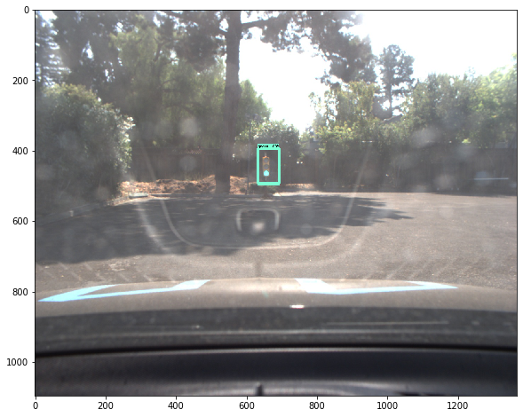

This is the project repo for the final project of the Udacity Self-Driving Car Nanodegree: Programming a Real Self-Driving Car. For more information about the project, see the project introduction [here](https://classroom.udacity.com/nanodegrees/nd013/parts/6047fe34-d93c-4f50-8336-b70ef10cb4b2/modules/e1a23b06-329a-4684-a717-ad476f0d8dff/lessons/462c933d-9f24-42d3-8bdc-a08a5fc866e4/concepts/5ab4b122-83e6-436d-850f-9f4d26627fd9).

Please use **one** of the two installation options, either native **or** docker installation.

### Native Installation

* Be sure that your workstation is running Ubuntu 16.04 Xenial Xerus or Ubuntu 14.04 Trusty Tahir. [Ubuntu downloads can be found here](https://www.ubuntu.com/download/desktop).
* If using a Virtual Machine to install Ubuntu, use the following configuration as minimum:
  * 2 CPU
  * 2 GB system memory
  * 25 GB of free hard drive space

  The Udacity provided virtual machine has ROS and Dataspeed DBW already installed, so you can skip the next two steps if you are using this.

* Follow these instructions to install ROS
  * [ROS Kinetic](http://wiki.ros.org/kinetic/Installation/Ubuntu) if you have Ubuntu 16.04.
  * [ROS Indigo](http://wiki.ros.org/indigo/Installation/Ubuntu) if you have Ubuntu 14.04.
* [Dataspeed DBW](https://bitbucket.org/DataspeedInc/dbw_mkz_ros)
  * Use this option to install the SDK on a workstation that already has ROS installed: [One Line SDK Install (binary)](https://bitbucket.org/DataspeedInc/dbw_mkz_ros/src/81e63fcc335d7b64139d7482017d6a97b405e250/ROS_SETUP.md?fileviewer=file-view-default)
* Download the [Udacity Simulator](https://github.com/udacity/CarND-Capstone/releases).

### Docker Installation
[Install Docker](https://docs.docker.com/engine/installation/)

Build the docker container
```bash
docker build . -t capstone
```

Run the docker file
```bash
docker run -p 4567:4567 -v $PWD:/capstone -v /tmp/log:/root/.ros/ --rm -it capstone
```

### Port Forwarding
To set up port forwarding, please refer to the [instructions from term 2](https://classroom.udacity.com/nanodegrees/nd013/parts/40f38239-66b6-46ec-ae68-03afd8a601c8/modules/0949fca6-b379-42af-a919-ee50aa304e6a/lessons/f758c44c-5e40-4e01-93b5-1a82aa4e044f/concepts/16cf4a78-4fc7-49e1-8621-3450ca938b77)

### Usage

1. Clone the project repository
```bash
git clone https://github.com/udacity/CarND-Capstone.git
```

2. Install python dependencies
```bash
cd CarND-Capstone
pip install -r requirements.txt
```
3. Make and run styx
```bash
cd ros
catkin_make
source devel/setup.sh
roslaunch launch/styx.launch
```
4. Run the simulator

### Real world testing
1. Download [training bag](https://s3-us-west-1.amazonaws.com/udacity-selfdrivingcar/traffic_light_bag_file.zip) that was recorded on the Udacity self-driving car.
2. Unzip the file
```bash
unzip traffic_light_bag_file.zip
```
3. Play the bag file
```bash
rosbag play -l traffic_light_bag_file/traffic_light_training.bag
```
4. Launch your project in site mode
```bash
cd CarND-Capstone/ros
roslaunch launch/site.launch
```
5. Confirm that traffic light detection works on real life images

### Other library/driver information
Outside of `requirements.txt`, here is information on other driver/library versions used in the simulator and Carla:

Specific to these libraries, the simulator grader and Carla use the following:

|        | Simulator | Carla  |
| :-----------: |:-------------:| :-----:|
| Nvidia driver | 384.130 | 384.130 |
| CUDA | 8.0.61 | 8.0.61 |
| cuDNN | 6.0.21 | 6.0.21 |
| TensorRT | N/A | N/A |
| OpenCV | 3.2.0-dev | 2.4.8 |
| OpenMP | N/A | N/A |

We are working on a fix to line up the OpenCV versions between the two.


### System Analysis
This project is composed of three parts.
First one is object detection that is made of retrained inference model with pre-trained. Second one is communication line with ROS. Every node has communication line of publish and subscribe. They get or receive data using ROS communication system. Last one is driving of car with PID control.


### Part 1. Object Detection
#### 1. Sample Images
We need to get and select the files to detect. Next, we set the labels to sort for traffic signs in each pictures. signs are like red, yellow, green.
It's easy to make labels in xml formats below links
reference : https://github.com/tzutalin/labelImg

#### 2. XML to CSV
We have to convert xmls of label information to csv for making TFRecords file. This helps to train easier.
To do complete, 
1. download git : https://github.com/tensorflow/models/ => tree/master/research/object_detection
2. run "python xmltocsv.py" in root of upper git installed

#### 3. CSV to TFRecord
to create train data:
   python generate_tfrecord.py --csv_input=data/train_labels.csv  --output_path=data/train.record
to create test data:
   python generate_tfrecord.py --csv_input=data/test_labels.csv  --output_path=data/test.record

#### 4. Training
I choose 'ssd_mobilenet_v1_coco_2018_01_28.config' for trainining.
for training : 10,000 times
```
simulator : python legacy/train.py --logtostderr --pipeline_config_path=train_carnd_sim/ssd_mobilenet_v1_coco_2018_01_28.config --train_dir=train_carnd_sim/

real : python legacy/train.py --logtostderr --pipeline_config_path=train_carnd_real/ssd_mobilenet_v1_coco_2018_01_28.config --train_dir=train_carnd_real/
```
for exporting graph : 100,000 times
```
simulator : python export_inference_graph.py --input_type image_tensor --pipeline_config_path train_carnd_sim/ssd_mobilenet_v1_coco_2018_01_28.config --trained_checkpoint_prefix train_carnd_sim/model.ckpt-10000 --output_directory carnd_capstone_sim_graph

real : python export_inference_graph.py --input_type image_tensor --pipeline_config_path train_carnd_real/ssd_mobilenet_v1_coco_2018_01_28.config --trained_checkpoint_prefix train_carnd_real/model.ckpt-100000 --output_directory carnd_capstone_realgraph
```
##### Result
Simulator          |  Real
:-------------------------:|:-------------------------:
  |  
:-------------------------:|:-------------------------:
  |  
:-------------------------:|:-------------------------:
  |  


### Part 2. Communication with ROS

In simulation, It's really important to synchronize message between modules. Because camera image processing, object detection, message processing, network performance and system performace make delay for communication, So I had to modify parameters. 
in bridge.py : publish_camera => 1 of 10th
dbw_node.py : loop => 10 Hz
waypoint_updater.py : loop => 10 Hz


### Part 3. PID Control
DBW node sends throttle, brake and steering to simulator
If throttle value is over than 0.12, then it's disconnected with server.

